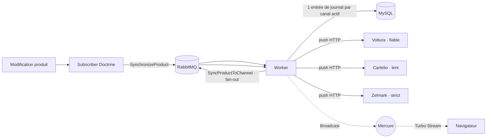

# OmniSync

**SaaS de synchronisation de catalogue e-commerce multi-canal.**
OmniSync diffuse produits, stocks et prix vers plusieurs marketplaces depuis une source unique de vérité, avec une architecture orientée messages fiable et un suivi en temps réel.

🔗 **Démo en ligne :** [omnisync.lzerri-project.fr](https://omnisync.lzerri-project.fr) · **Comptes de démo** fournis sur la page de connexion.


---

## À propos

OmniSync a été développé **pour un client**. La production réelle étant sous confidentialité, ce dépôt et l'instance liée plus haut constituent une **démonstration iso-production** (données fictives, comptes de test) reflétant l'architecture et les fonctionnalités livrées.

**Le besoin :** un revendeur gérant un catalogue d'électronique grand public doit publier et tenir à jour ses fiches produits (prix, stock) sur plusieurs marketplaces aux comportements hétérogènes — l'une rapide, une autre lente, une troisième exigeante (validation stricte, quotas). Les mises à jour manuelles sont sources d'erreurs et de surventes.

**La réponse :** une plateforme centrale (source de vérité) qui **propage automatiquement** chaque changement vers les canaux via une **file de messages**, encaisse les pannes (retries, dead-letter) sans bloquer l'utilisateur, et offre une **supervision en temps réel**.

## Fonctionnalités

- **Gestion du catalogue** — CRUD produits (avec images), import CSV en masse traité en arrière-plan avec rapport d'erreurs.
- **Synchronisation multi-canal** — push automatique sur modification (ou manuel) vers tous les canaux actifs, via des connecteurs HTTP.
- **Fiabilité** — traitement asynchrone (RabbitMQ), **retries** à backoff exponentiel et **dead-letter** par message, isolation des pannes par canal.
- **Temps réel** — le journal des synchronisations, les imports et le tableau de bord se mettent à jour **en direct** (Mercure + Turbo Streams), sans rechargement.
- **Supervision** — journal des synchronisations (relance des échecs), santé des canaux en direct, tableau de bord (KPI catalogue & synchros, alertes de stock).
- **Sécurité** — authentification, réinitialisation de mot de passe, rôles **Administrateur / Gestionnaire**.

## Architecture

OmniSync est un **monolithe Symfony** (source de vérité) qui pilote des **canaux** simulés par un microservice « marketplace » (Node/Express) déployé en 3 instances aux personnalités configurables.



- **Déclenchement** : un *listener* Doctrine publie un message léger en `postFlush` (sûr car aucune écriture en base) ; le **fan-out** (création du journal + un message par canal) est fait côté worker.
- **Découplage** : interface `ChannelConnector` + DTO `ProductPayload` ; la config de connexion (URL, clé API) vit dans l'environnement (jamais en base), résolue par code.
- **Temps réel** : l'attribut `#[Broadcast]` sur les entités diffuse les changements via Mercure, appliqués en Turbo Streams côté navigateur.

## Stack technique

| Domaine | Technologies |
|---|---|
| Back | Symfony 7.4 LTS, PHP 8.4, Doctrine ORM |
| Messages | Symfony Messenger, RabbitMQ 3.13 (AMQP) |
| Temps réel | Mercure, Symfony UX Turbo |
| Front | Webpack Encore, Tailwind CSS v4, Stimulus |
| Données | MySQL 8 |
| Canaux | Node.js / Express (microservice dockerisé) |
| Qualité | PHPStan (niveau 7), php-cs-fixer |
| Prod | Docker, **FrankenPHP** (serveur + hub Mercure intégrés), Apache (reverse proxy + TLS), CI/CD Jenkins |

## Démarrage en local

> Approche de dev : **les services tournent dans Docker, PHP tourne en local** (via le CLI Symfony).

```bash
# 1. Services (MySQL, RabbitMQ, Mailpit, Mercure, les 3 canaux marketplace)
docker compose up -d

# 2. Dépendances
composer install
npm install && npm run build

# 3. Base de données + données de démo (comptes, canaux, catalogue)
symfony console doctrine:migrations:migrate
symfony console doctrine:fixtures:load

# 4. Serveur web + worker de messages (à garder ouvert dans un terminal)
symfony serve -d
symfony console messenger:consume async -vv
```

L'application est alors disponible sur l'URL indiquée par `symfony serve`. Connexion avec un compte de démo : **admin@omnisync.test** / `password` (administrateur) ou **manager@omnisync.test** / `password` (gestionnaire).

Quelques commandes utiles :

```bash
symfony console app:product:sync <id|sku>   # synchroniser un produit en ligne de commande
symfony console app:products:import <csv>    # importer un catalogue CSV (synchrone, CLI)
vendor/bin/phpstan analyse                   # analyse statique (niveau 7)
```

## Déploiement (production)

L'image de production est construite avec **FrankenPHP** (multi-stage : build des assets Node, dépendances Composer sans dev, runtime PHP optimisé). Le hub Mercure est **intégré au serveur**, servi sur la même origine que l'application.

```bash
cp .env.prod.dist .env.prod          # renseigner les secrets (jamais commités)
docker compose -f compose.prod.yaml --env-file .env.prod up -d --build
docker compose -f compose.prod.yaml --env-file .env.prod run --rm app php bin/console doctrine:migrations:migrate --no-interaction
docker compose -f compose.prod.yaml --env-file .env.prod run --rm app php bin/console app:demo:seed
```

En production, l'application est exposée uniquement en local (`127.0.0.1:8080`) derrière **Apache** qui gère le sous-domaine et le **TLS (Let's Encrypt)**. Le déploiement est automatisé par un pipeline **Jenkins** déclenché sur la branche `master`.

## Auteur

**Louis Zerri** — Développeur Web Full-Stack
[lzerri-project.fr](https://lzerri-project.fr) · [GitHub](https://github.com/LouisZerri)
